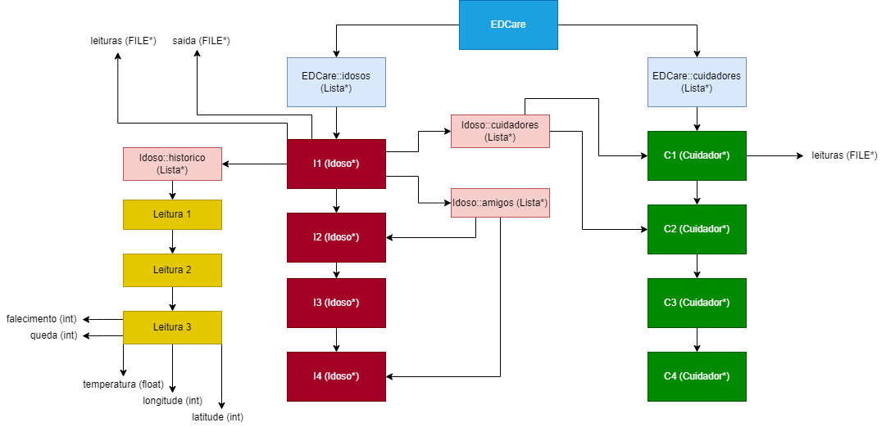
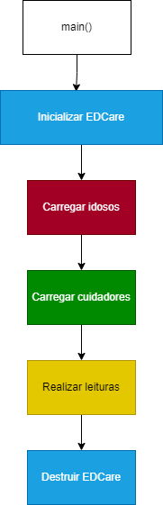
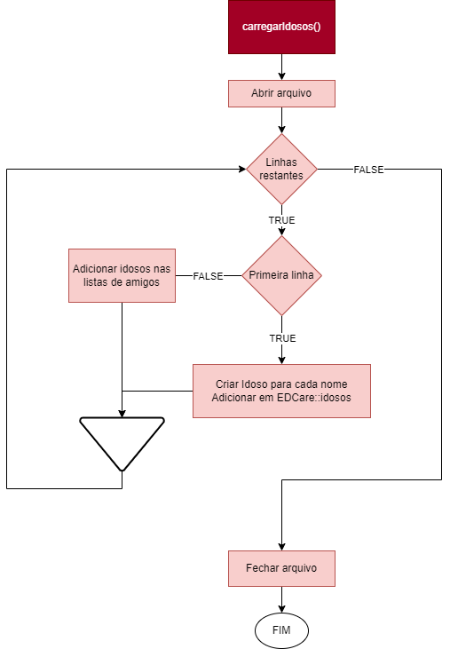
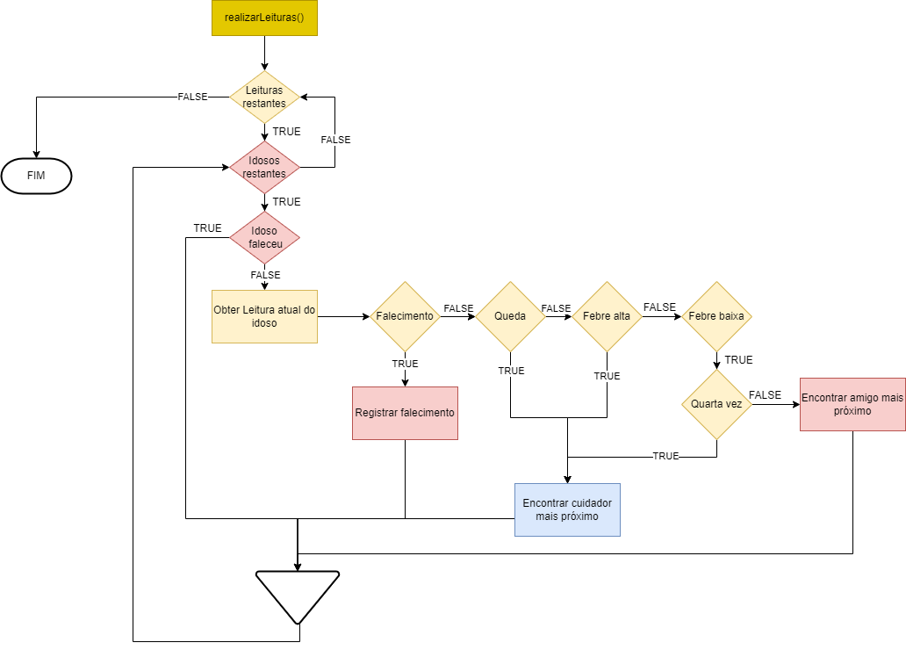
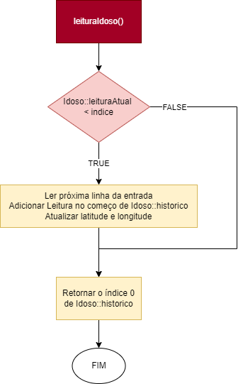
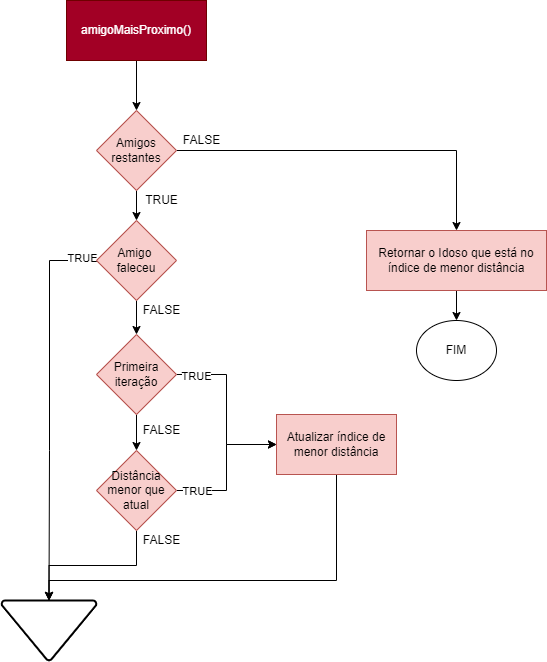
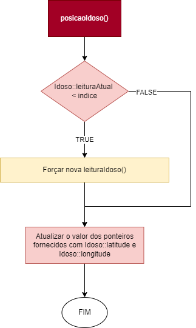
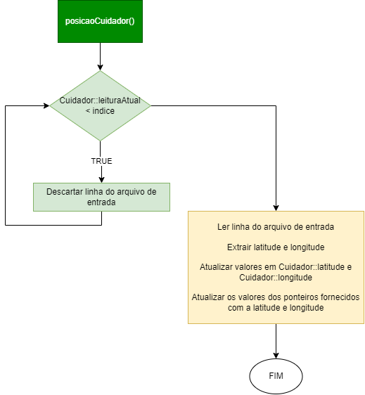

### Universidade Federal do Espírito Santo

### INF09292 - Estrutura de Dados I - 2021/2

### Primeiro trabalho

### Aluno: 2020205193 Felipe Pereira Umpierre

### Professora: Patricia Dockhorn Costa

# Documentação do trabalho

# Introdução

O programa implementa um sistema de rede de apoio para idosos formada por amigos (outros idosos) e também cuidadores. Os idosos usam sensores que monitoram sua posição, temperatura, se houve queda e se houve falecimento. Os cuidadores usam um outro tipo de sensor que monitora apenas sua posição. O sistema registra uma quantidade indefinida de idosos e cuidadores, nem todos relacionados.

Cada idoso possui sua própria rede de apoio, ou seja, determinados amigos e determinados cuidadores do sistema que podem lhe prover assistência quando necessário, e o papel do programa é determinar, após ler os dados de todos os sensores necessários, se o idoso precisa de uma assistência básica, oferecida pelo amigo que estiver mais próximo, ou de cuidados mais específicos, oferecidos pelo cuidador que estiver mais próximo.

## Como executar o programa

## Condições de teste

# Implementação

## TADs implementados

- Usamos um TAD `Idoso` para guardar as informações sobre cada idoso, inlcuindo seu nome, sua lista de amigos, sua lista de cuidadores, sua lista de leituras dos sensores, seus próprios arquivos de entrada e saída e outras propriedades relavantes para o funcionamento do programa.

- O TAD `Cuidador` guarda informações sobre cada cuidador do sistema, como seu nome, sua posição e seus próprios arquivos de entrada e saída, além de outras propriedades relevantes.

- O TAD `Leitura` guarda informações sobre a leitura de um idoso: se houve falecimento, se houve queda, temperatura e posição (em latitude e longitude).

- No TAD `Lista`, implementamos uma lista encadeada genérica que pode ser inicializada com os tipos `LISTA_IDOSOS`, `LISTA_CUIDADORES` ou `LISTA_LEITURAS` para guardar um conjunto dos TADs anteriores.

- Por fim, o TAD `EDCare` se trata de uma instância do próprio sistema, guardando todos os idosos e cuidadores do sistema e outras propriedades relevantes.

## Funcionamento

### Fluxo principal

No fluxo principal do programa, inicializamos uma instância de `EDCare`, e usamos as funções `EDCare::carregarIdosos` e `EDCare::carregarCuidadores` para ler os arquivos de entrada, criar os objetos `Idoso` e `Cuidador` necessário e criar as relações de toda a rede de apoio.

Em seguida, a função `EDCare::realizarLeituras` é responsável por ler, sequencialmente, os sensores de cada idoso, tratar as informações recebidas e acionar os amigos e cuidadores mais próximos sempre que for necessário, até que acabem as leituras disponíveis na entrada, imprimindo também as saídas nos arquivos correspondentes.

Por fim, `EDCare::destruirEDCare` é responsável por liberar toda a memória dinâmica alocada para o programa, incluindo listas e seus elementos.

---

### EDCare::carregarIdosos

Para carregar os idosos e suas redes de apoio, identificamos o caminho e abrimos o arquivo `apoio.txt` da entrada, iterando linha a linha.

Na primeira linha do arquivo, usamos `strtok` sequencialmente para extrair os nomes de todos os idosos e inicializar um `Idoso` para cada um, inserindo-os no **fim** da lista `EDCare::idosos` e atualizamos a quantidade de idosos incrementando `EDCare::quantidadeIdosos`.

Nas próximas linhas, determinamos os amigos dos idosos. Novamente, usamos `strtok` para extrair o nome do idoso de interesse, e `Lista::encontrarNome` para obter o ponteiro `Idoso*` associadoa a esse nome na lista `EDCare::idosos`.

Com mais um `strtok` sequencial, obtemos o nome de um amigo, encontramos seu ponteiro na lista e o adicionamos **no início** da lista `Idoso::amigos`. Também adicionamos o ponteiro do "idoso de interesse" **no início** lista de amigos do amigo, já que a amizade é sempre recíproca. Esta implementação funcionaria para vários nomes de amigos em sequência na mesma linha, apesar de não parecer necessário nas entradas de exemplo.

Sempre que um idoso é adicionado como amigo, usamos `Idoso::incrementarAmigos` para atualizar a quantidade de amigos, necessária para loops futuros.

---

### EDCare::carregarCuidadores

De forma muito parecida com a função anterior, iteramos o arquivo `cuidadores.txt` para, ainda na primeira linha, identificar todos os nomes de cuidadores e inicializar um objeto `Cuidador` para cada um, adicionando-os **no início** lista `EDCare::cuidadores` e incrementando `EDCare::quantidadeCuidadores`.

Ao inicializar o primeiro cuidador, no entanto, aproveitamos para iterar o arquivo com suas próprias entradas `<nome>.txt` e contar a quantidade de linhas dele. Isto se faz necessário para determinar `EDCare::quantidadeLeituras`, necessário para loops futuros. Não é possível fazer o mesmo usando a entrada de um idoso, pois este pode vir a falecer e ter menos leituras que os outros, algo que não ocorre com os cuidadores. Após esta determinação, o usamos `rewind` para que o arquivo possa ler lido do começo novamente no futuro.

Nas próximas linhas de `cuidadores.txt`, identificamos o nome do idoso de interesse, obtemos seu ponteiro na lista, e agora para cada nome de cuidador que também estiver na linha, adicionamos seu ponteiro **no início** da lista `Idoso::cuidadores`.

Novamente, usamos `Idoso::incrementarCuidadores` para atualizar o tamanho da lista, necessário futuramente.

Agora, temos as listas `EDCare::idosos` e `EDCare::cuidadores` contendo ponteiros para todos os idosos e cuidadores do sistema, enquanto cada idoso possui uma lista `Idoso::amigos` e `Idoso::cuidadores` apontando para os amigos e cuidadores que podem lhe prover assistência.

---

### EDCare::realizarLeituras

Aqui, fazemos um loop de `0` até `EDCare::quantidadeLeituras` para processar uma a uma todas as leituras disponíveis na entrada.

Em cada leitura, iteramos a lista `EDCare::idosos` de 0 a `EDCare::quantidadeIdosos` para realizar a leitura de cada um.

Na leitura de um idoso específico, verificamos se este já teve falecimento registrado com `Idoso::idosoFaleceu` e o ignoramos com `continue`, se for o caso.

Do contrário, obtemos sua leitura mais recente por meio de `Idoso::leituraIdoso`, verificamos os casos de falecimento, queda, febre alta, febre baixa ou febre baixa reincidente, acionando o amigo ou cuidador mais próximo de acordo com a necessiade, determinados pelas funções `Idoso::amigoMaisProximo` e `Idoso::cuidadorMaisProximo`.

As saídas correspondentes ao caso tratado são impressas na saída usando `Idoso::imprimirSaida`.

---

### Idoso::leituraIdoso

Para retornar a leitura atual do idoso, primeiro verificamos se ele já foi lido na "rodada" atual. Se a propriedade interna `Idoso::leituraAtual` for menor que o `indice` informado na função, lemos a próxima linha do arquivo de entrada do idoso.

Se não for possível extrair os dados de queda, temperatura, latitude e longitude, registramos o falecimento do idoso em `Idoso::faleceu`. Se os dados forem lidos corretamente, inicializamos um objeto `Leitura` com eles, e o inserimos **no início** da lista `Idoso::historico`. Atualizamos também sua posição pelas propriedades `Idoso::latitude` e `Idoso::longitude`.

Por fim, tendo criado ou não uma nova `Leitura`, retornamos a leitura mais recente de `Idoso::historico`, encontrada no índice 0 por `Lista::listaN`.

---

### Idoso::amigoMaisProximo

Para determinar o amigo mais próximo, iteramos a lista `Idoso::amigos` (ignorando os amigos registrados com falecidos),obtemos a posição de cada um por `Idoso::posicaoIdoso`, calculamos a distância entre as coordenadas do idoso e do amigo usando `Idoso::calcularDistancia`.

Determinamos o índice da lista de menor distância calculada, este então retornado por `Lista::listaN`.

---

### Idoso::cuidadorMaisProximo

Da mesma forma, para determinar o cuidador mais próximo, iteramos a lista `Idoso::cuidadores` e determinamos a posição de cada com `Cuidador::posicaoCuidador`.

O cuidador no índice de menor distancia obtida por `Idoso::calcularDistancia` é retornado ao ser encontrado por `Lista::listaN`.

---

### Idoso::posicaoIdoso

Para determinar a posição do idoso, verificamos se ela ainda precisa ser atualizada na rodada atual (leituraAtual < indice), e forçamos uma nova leitura com `Idoso::leituraIdoso`, se necessário.

Depois, os valores de `Idoso::latitude` e `Idoso::longitude` são armanzenados nos ponteiros fornecidos para a função.

---

### Cuidador::posicaoCuidador

Para determinar a posição do cuidador, precisamos ler linhas até que `Cuidador::leituraAtual` seja igual ao índice fornecido para a função.

Ao obter a linha correta da rodada atual, extraimos os dados de posição e armazenamos em `Cuidador::latitude` e `Cuidador::longitude`, cujos valores são também armazenados nos ponteiros fornecidos para a função.

# Conclusão
